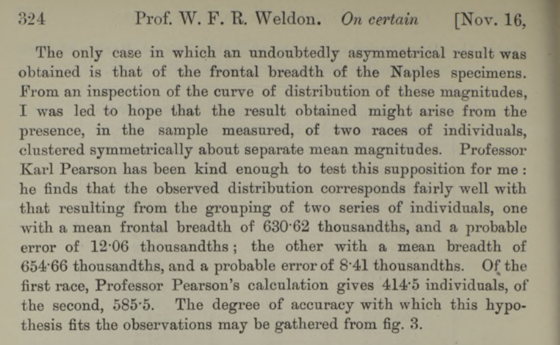

# Weldon observation and supposition

In 1892, Weldon and his wife collected extensive data on populations of the crab, Carcinus Moenas, and observed that one trait, the forehead width to the body length ratio, in the crabs from Naples bay actually showed a highly skewed, rather than a normal, distribution.

Weldon wondered whether this distribution could be the result of the population being a mix of two different normal distributions, with the possible implication that the population consisted of two different races or 'types' in the same locality.

# The Pearson solution

### Method of moments

Pearson derived a ninth degree polynomial in the first 5 moments and located the real roots of this polynomial. Each root gives a candidate mixture that matches the first 5 moments; there were two valid solutions, among which Pearson selected the one whose 6-th moment was closest to the observed empirical 6-th moment.

The calculation was formidable and done by hands, without the aid of computing machinery of any kind.




### Plot of the two normal distributions

The horizontal scale represents thousandths of the carapace length, the vertical scale numbers of individuals. Each ordinate of the upperdotted curve is the sum of the corresponding ordinates of the two component curves.

```{r setup, include=FALSE }
knitr::opts_chunk$set(warning = FALSE, message = FALSE) 

library("dplyr")
library("ggpubr")
library("splitstackshape")
library("ggprism")
library("MixtureInf")
library("data.table")
library("moments")
library("mixtools")
library(mclust)
library(ggplot2)
library(cowplot) 
library(magick)
library(RColorBrewer)
library(cowplot)
library(gridExtra)


palette = get_palette("jco", 6)


```

```{r echo=FALSE, fig.cap="*On Certain Correlated Variations in Carcinus maenas (1893) W. F. R. Weldon*", fig.align='left', warning=FALSE, message=FALSE}
knitr::opts_chunk$set(echo = TRUE)

ggdraw() + draw_image("pearson_plot.png") 

```

```{r}
data(pearson)
crabs.pearson_df = pearson
crabs.pearson_clean_df =pearson[pearson$freq != 0, ]
crabs.pearson_clean_df['type'] = "unknown"

crabs.df = setDT(expandRows(crabs.pearson_clean_df, "freq"))[,][]

crabs.df$ratiob = crabs.df$ratio 
crabs.df$ratio = crabs.df$ratio + 0.0020
crabs.df$ratioj = jitter(crabs.df$ratio , amount = 0.0020)


```

### Weldons's Dataset

The data give the ratio of "forehead" breadth to body length for 1000 crabs sampled at Naples by Professor W.F.R. Weldon. The observations are grouped in intervals of 0.0040 width and for each range is reported the count. The Waldon's dataset contains 29 rows, with 2 columns, "ratio" and "freq" (the count).

```{r table, echo=FALSE, message=FALSE, warning=FALSE}
#knitr::kable(crabs.pearson_df[1:10,c("ratio","freq")])
crabs.pearson_df
```

### Observed densit plot

```{r}

gghistogram(crabs.df$ratio,
            binwidth =0.0040, 
            add_density = TRUE,
            y= "..density..",
            xlab = "forehead width to body length ratio",
            add = "mean",
            color = "#E7B800",
            fill = "#E7B800", palette = c("#00AFBB", "#E7B800"),)

#crabs.pearson_df
#summary(crabs.pearson_df)

```

# Checking Normality

The comparison between the observed density and a normal distribution with the same mean and variance, highlights that the observed curve is asymmetrical. This is just one hint that underlying distribution may be not a simple Gaussian.

```{r}
#Install and load required packages
#library(pacman)
#pacman::p_load('colorspace','ggplot2','patchwork','wesanderson')


ggdensity(crabs.df,
          x="ratioj", fill = '#E7B800', color = 'type', 
          main = "Density plot",
          xlab = "forehead width to body length ratio",
          palette = "jco", add = 'mean') +
stat_overlay_normal_density(color = "#00AFBB", lwd = 1)


```

### Q--Q plot

A Q-Q plot, short for "quantile-quantile" plot, is used to assess whether or not a set of data potentially came from some theoretical distribution.

In most cases, this type of plot is used to determine whether or not a set of data follows a normal distribution.

If the data is normally distributed, the points in a Q-Q plot will lie on a straight diagonal line.

Conversely, the more the points in the plot deviate significantly from a straight diagonal line, the less likely the set of data follows a normal distribution.

```{r}

p = ggqqplot(crabs.df, x="ratioj",  palette = c("#00AFBB", "#E7B800"), color="type")


p

```

### Box plot

Boxplot shows the median's asymmetry and the presence of many outliers, this is very unlikely in a Gaussian distribution.

```{r}


ggboxplot(crabs.df, 
          palette =c("#FC4E07","#00AFBB", "#E7B800", "#FC4E07"),
          color = 'type',
          y = "ratioj",title = "", ylab = "Ratio", xlab="")+

  geom_jitter(size = 0.05, colour = 2)


```

## Hypothesis testing

The Shapiro-Wilk apparently gives a very low p-value rejecting the null hypothesis that the distribution was normal. Unfortunately we cannot rely on this result because our data are *binned*

When data are grouped into bins, with several counts in each bin, Pearson's chi- square test for goodness of fit may be applied.

(Mathematical Statistics and Data Analysis by Rice)

```{r}

  
sw_test <- shapiro.test(crabs.df$ratiob)


test_tibble <- tibble::tribble(
   ~method,   ~pValue,
  sw_test$method,     format.pval(sw_test$p.value, digits=4 )
)  
  
test_tibble[,c("method","pValue")]

```


### MLE parameters extimation from binned data using optim


```{r}


thresh <- crabs.pearson_df[,1]
pop <- crabs.pearson_df[,2]

thresh <- append(thresh,0.6955 + 0.004)
bin.lower = thresh
bin.upper = thresh

bin.lower = head(bin.lower,-1)
bin.upper = tail(bin.upper,-1)

bin.mid <- (bin.upper + bin.lower)/2

n <- sum(pop)
mu <- sum(bin.mid * pop) / n
sigma2 <- (sum(bin.mid^2 * pop) - n * mu^2) / (n-1)
sigma <- sqrt(sigma2)

likelihood.log <- function(theta, counts, bin.lower, bin.upper) {
  mu <- theta[1]; sigma <- theta[2]  
  -sum(sapply(1:length(counts), function(i) {
    counts[i] * 
      log(pnorm(bin.upper[i], mu, sigma) - pnorm(bin.lower[i], mu, sigma))
  }))
}

coefficients <- optim(c(mu, sigma), function(theta) 
  likelihood.log(theta, pop,bin.lower, bin.upper ))$par


coefficients
```

### Pearson Chi Square test
 
We need to rearrange bins in order to avoid any low count (less then 5) that causes poor chi-squared approximation.


```{r}


thresh <- crabs.pearson_df[,1]
pop <- crabs.pearson_df[,2]

thresh <- c(0.5835 - 0.0040, thresh)
thresh <- c(0.5835 - 0.0040*2, thresh)
thresh <- c(0.5835 - 0.0040*3, thresh)
thresh <- append(thresh,0.6955 +0.0040)
thresh <- append(thresh,0.6955 +0.0040*2)
thresh <- append(thresh,0.6955 +0.0040*3)
thresh <- append(thresh,0.6955 +0.0040*4)
pop <- crabs.pearson_df[,2]
pop <- append(pop,0)
pop <- append(pop,0)
pop <- append(pop,0)
pop <- c(0,pop)
pop <- c(0,pop)
pop <- c(0,pop)


mpop = matrix(pop,nrow = 7,ncol = 5)
zpop = apply(mpop[,], 2, function(x) sum(x))

mthresh = matrix(thresh,nrow=7,ncol=5)
zthresh = mthresh[1,]


zdf <- data.frame(zthresh,zpop)
colnames(zdf) <- c("ratio", "count")

zdf

```

Then, for every bin, we predict the population count in the the normal distribution fitted with MLE, and apply the standard chi-squared test (observed frequency vs theoretical probability). 


```{r}

pop = zpop
thresh = zthresh
thresh <- append(thresh,0.6835 + 0.028)


bin.lower = thresh
bin.upper = thresh

bin.lower = head(bin.lower,-1)
bin.upper = tail(bin.upper,-1)

bin.mid <- (bin.upper + bin.lower)/2


breaks <- sort(unique(c(bin.lower, bin.upper)))
fit <- mapply(function(l, u) exp(-likelihood.log(coefficients, 1, l, u)),
              c(-Inf, breaks), c(breaks, Inf))
observed <- sapply(breaks[-length(breaks)], function(x) sum((pop)[bin.lower <= x])) -
  sapply(breaks[-1], function(x) sum((pop)[bin.upper < x]))


predict <- function(a, b, mu, sigma, n) {
  n * ( ifelse(is.na(b), 1, pnorm(b, mean=mu, sd=sigma)) 
        - pnorm(a, mean=mu, sd=sigma) )
}
  
  
pred <- mapply(function(a,b) predict(a,b,coefficients[1], coefficients[2], sum(pop)), 
               head(thresh,-1), tail(thresh,-1))
  
thresh = head(thresh,-1)

#chisq <- sum((pred-pop)^2 / pred)
#df <- length(pop) - 2
#ss= pchisq(chisq, df=6, lower.tail=FALSE)
#ss


testdt <- data.frame(x = thresh, count = pred)
h1 <- ggplot(data = testdt) + 
  ggtitle("Theoretical from MLE normal fit") + ylab("count") +
  theme(plot.title = element_text(hjust = 0.5)) +
  xlab("forehead width to body length ratio") +
  geom_bar(aes(x = x, y = count), stat = "identity",
             color = "#00AFBB",
             fill = "#00AFBB", palette = c("#00AFBB", "#E7B800")
           )+ scale_y_continuous(breaks = seq(0, 500, 50))+coord_cartesian(ylim=c(0,500)) 


h2 <- ggplot(data = testdt) + 
  ggtitle("Observed") + ylab("count") +
  xlab("forehead width to body length ratio") +
  theme(plot.title = element_text(hjust = 0.5)) +
geom_bar(aes(x = x, y = pop), stat = "identity",
         color = "#E7B800",
             fill = "#E7B800", palette = c("#00AFBB", "#E7B800"))+ scale_y_continuous(breaks = seq(0, 500, 50))+coord_cartesian(ylim=c(0,500))


grid.arrange(h1,h2, ncol=2, as.table = FALSE, widths=c(1,1), heights=c(0.5))

```


```{r}


set.seed(0)
chisq.test(c(0, observed, 0), p=fit, simulate.p.value=T)


chisq.test(c(0, observed, 0), p=fit, simulate.p.value=F)


```


The pValue is very low, we can reject the null hypothesis the data come from the MLE fitted normal distribution. 


# Pearson calculation in R

We can repeat in R the same calculations done by Karl Pearson by hand.
At this time there is not a package in R that implements the method of moments used by Pearson, so I used the code from Carlos Amendola in the appendix of his valuable PhD thesis [Algebraic Statistics of Gaussian Mixtures](https://depositonce.tu-berlin.de/bitstream/11303/7284/4/amendola_ceron_carlos.pdf).

```{r}

f <- function(m, p, mu1, s1, mu2, s2) {
  mm1 <- c(mu1, mu1**2 + s1, 3*mu1*s1 + mu1**3, 3*s1**2 + 6*s1*mu1**2 + mu1**4, 15*mu1*s1^2 + 10*s1*mu1^3 + mu1^5)
  mm2 <- c(mu2, mu2**2 + s2, 3*mu2*s2 + mu2**3, 3*s2**2 + 6*s2*mu2**2 + mu2**4, 15*mu2*s2^2 + 10*s2*mu2^3 + mu2^5)
  mm <- p*mm1 + (1-p)*mm2;
  sum( (m-mm)**2 )
}


x <- crabs.df$ratiob
m <- c(mean(x), mean(x^2), mean(x^3), mean(x^4), mean(x^5), mean(x^6) )


PearsonMOM <- function(moms) {
  cums = toCumulants(moms)
  
  k1 = cums[1]
  k2 = cums[2]
  k3 = cums[3]
  k4 = cums[4]
  k5 = cums[5]
  k6 = cums[6]
  
  sols = 0
  
  if (k3 == 0 & k5 == 0) {
    if (k4 == 0) {
      print(
        cat(
          "Data resembles a single Gaussian with mean ",
          k1,
          "
and variance ",
k2,
". No honest mixture.",
"\n"
        )
      )
      
      sols = 1
      
    }
    else {
      if (k4 > 0) {
        print(cat("Data is consistent only with an equal means model."
                  , "\n"))
      }
      else{
        print(
          cat(
            "Data displays symmetry, different means alternative
still explored.",
"\n"
          )
        )
      }
      e2 = k2 ^ 2 - k4 / 3 + k2 * k6 / (5 * k4)
      e1 = 2 * k2 + k6 / (5 * k4)
      d = e1 ^ 2 - 4 * e2
      
      if ((e1 > 0 & e2 > 0) & d > 0) {
        v1 = (e1 - sqrt(d)) / 2
        v2 = (e1 + sqrt(d)) / 2
        a = (v2 - k2) / (v2 - v1)
        print(cat(
          "(alpha,mu1,mu2,sigma1,sigma2)=
",
c(a, k1, k1, sqrt(v1), sqrt(v2)),
"\n"
        ))
        sols = 1
      }
      else {
        print(cat("Negative variance found, discarding equal means."
                  , "\n"))
      }
    }
  }
  rootsp = polyroot(
    c(
      -8 * k3 ^ 6,
      -32 * k3 ^ 4 * k4,
      -21 * k3 ^ 2 * k4 ^ 2 - 24 * k3 ^ 3 * k5,
      96 * k3 ^ 4 + 9 * k4 ^ 3 - 36 * k3 * k4 * k5,
      148 * k3 ^ 2 * k4 - 6 * k5 ^ 2,
      24 * k3 * k5 + 30 * k4 ^ 2,
      12 * k3 ^ 2,
      28 * k4,
      0,
      8
    )
  )
  
  rootsord = rootsp[sort.list(abs(Im(rootsp)))]
  
  #cat("Pearson’s polynomial roots: ", rootsord, "\n")
  
  rootsreal = subset(rootsord, abs(Im(rootsord)) < 0.01 & Re(rootsord) < 0)
  
  cat(
    "Pearson’s polynomial appears to have ",
    length(rootsreal),
    "negative real roots.",
    "\n"
  )
  
  if (length(rootsreal) > 0) {
    p = Re(rootsreal)
    
    s = (2 * k3 ^ 3 + 6 * k3 * k4 * p + 3 * k5 * p ^ 2 - 8 * k3 * p ^ 3) / (p * (4 * k3 ^ 2 + 3 * k4 * p + 2 * p ^ 3))
    
    m1 = (s - sqrt(s ^ 2 - 4 * p)) / 2
    m2 = (s + sqrt(s ^ 2 - 4 * p)) / 2
    
    R1 = p + k2
    R2 = (k3 / p + s) / 3
    
    var1 = R1 - m1 * R2
    var2 = R1 - m2 * R2
    
    sigma1 = sqrt(ifelse(var1 >= 0, var1, NA))
    sigma2 = sqrt(ifelse(var2 >= 0, var2, NA))
    
    alpha = m2 / (m2 - m1)
    
    mu1 = m1 + k1
    mu2 = m2 + k1
    
    sixth = Inf

    for (i in 1:length(rootsreal)) {
      if (is.na(sigma1[i]) | is.na(sigma2[i])) {
        cat("Negative variance found, removing root.", "\n")
      }
      else{
        sixth[i] = abs(mixtmoms(c(
          alpha[i], mu1[i], mu2[i],
          sigma1[i], sigma2[i]
        ))[6] - moms[6])
        cat(
          "(i,alpha,mu1,mu2,sigma1,sigma2, sixth[i])=",
          c(i, alpha[i], mu1[i], mu2[i], sigma1[i], sigma2[i], sixth[i]),
          "\n"
        )
        
        
        sols = sols + 1
        
      }
    }
  }
  if (sols > 1) {
    j = which.min(sixth) 
    
    cat(
      "Of the ",
      sols,
      " statistically meaningful solutions, the closest to the sample’s sixth moment is",
      "(alpha,mu1,mu2,sigma1,sigma2)=
",
c(alpha[j], mu1[j], mu2[j], sigma1[j], sigma2[j]),"\n");
    
    PMM <- list("alpha"=c(alpha[j],1-alpha[j]),"mu" = c(mu1[j], mu2[j]),"sigma"=c(sigma1[j], sigma2[j]))

    return(PMM)
    
  } else{
    if (sols == 1) {
      print("Unique statistically meaningful solution found.")
    }
    else {
      print("No solutions, the data does not come from a mixture
of two Gaussians.")
    }
  }
}

toCumulants <- function(moms) {
  m1 = moms[1]
  m2 = moms[2]
  m3 = moms[3]
  m4 = moms[4]
  m5 = moms[5]
  m6 = moms[6]
  k1 = m1
  k2 = m2 - m1 ^ 2
  k3 = m3 - 3 * m1 * m2 + 2 * m1 ^ 3
  k4 = m4 - 4 * m1 * m3 - 3 * m2 ^ 2 + 12 * m1 ^ 2 * m2 - 6 * m1 ^ 4
  k5 = m5 - 5 * m1 * m4 - 10 * m2 * m3 + 20 * m1 ^ 2 * m3 + 30 * m1 * m2 ^
    2 - 60 * m1 ^ 3 * m2 + 24 * m1 ^ 5
  
  k6 = m6 - 6 * m1 * m5 - 15 * m2 * m4 + 30 * m1 ^ 2 * m4 - 10 * m3 ^ 2 + 120 *
    m1 * m2 * m3
  - 120 * m1 ^ 3 * m3 + 30 * m2 ^ 3 - 270 * m1 ^ 2 * m2 ^ 2 + 360 * m1 ^ 4 *
    m2 - 120 * m1 ^ 6
  
  cums = c(k1, k2, k3, k4, k5, k6)
  
  return(cums)
}


mixtmoms <- function(params) {
  alpha = params[1]
  mu1 = params[2]
  mu2 = params[3]
  sigma1 = params[4]
  sigma2 = params[5]
  
  m1 = alpha * mu1 + (1 - alpha) * mu2
  
  m2 = alpha*(mu1^2 + sigma1^2) + (1 - alpha) * (mu2^2+ sigma2^2)
  
  m3 = alpha * (mu1 ^ 3 + 3 * mu1 * sigma1 ^ 2) + 
      (1 - alpha) * (mu2 ^ 3 + 3 * mu2 * sigma2 ^ 2)
  
  m4 = alpha * (mu1 ^ 4 + 6 * mu1 ^ 2 * sigma1 ^ 2 + 3 * sigma1 ^ 4) + 
       (1 - alpha) * (mu2 ^ 4 + 6 * mu2 ^ 2 * sigma2 ^ 2 + 3 * sigma2 ^ 4)
  
  m5 = alpha * (mu1^5 + 10*mu1^3 * sigma1^2 + 15 * mu1 * sigma1 ^ 4) + 
       (1 - alpha) * (mu2 ^ 5 + 10 * mu2 ^ 3 * sigma2 ^ 2 + 15 * mu2 * sigma2^4)
  
  m6 = alpha * (mu1 ^ 6 + 15 * mu1 ^ 4 * sigma1 ^ 2 + 45 * mu1 ^ 2 * sigma1 ^ 4 + 15 * sigma1 ^ 6) + 
       (1 - alpha) * (mu2 ^ 6 + 15 * mu2 ^ 4 * sigma2 ^ 2 + 45 * mu2 ^ 2 * sigma2 ^4 + 15 * sigma2 ^ 6)
  
  moms = c(m1, m2, m3, m4, m5, m6)
  
  return(moms)
}


PMM <- PearsonMOM(m)

#if (!require('pacman')) install.packages('pacman'); library('pacman')

sc =  scale_colour_manual(
    "",
    breaks = c(
      "Observed data",
      "Normal comp. 1",
      "Normal comp. 2",
      "Sum of the two comp."
    ),
    values = c(
      "Observed data" = palette[1],
      "Normal comp. 1" = palette[3],
      "Normal comp. 2" = palette[4],
      "Sum of the two comp." = palette[2]
    )
  ) 


pearsonPlot = ggplot(crabs.df, aes(x = ratiob)) +
  theme_minimal() +theme(legend.position = "bottom") +
  sc +
  xlab("forehead width to body length ratio") +
  ylab("Number of individuals") +
  geom_line(stat = "count", lwd = .8, aes(colour="Observed data")) +
  geom_function(
    fun = function(x) {
      (PMM$alpha[1] * (dnorm(x, mean = PMM$mu[1], sd = PMM$sigma[1])) + PMM$alpha[2] * (dnorm(x, mean = PMM$mu[2], sd = PMM$sigma[2]))) * 1000 * 0.004
    },
    linetype = "dashed",
    lwd = .8,
    aes(colour="Sum of the two comp.") 
    
  ) +
  mapply(
    function(mean, sd, lambda,n, binwidth,col) {
      stat_function(
        fun = function(x) {
          (dnorm(x, mean = mean, sd = sd)) * n * binwidth * lambda
        },
        aes(colour=col),
        linetype = "dashed",
        lwd = 0.8
      )
    },
    mean = PMM$mu,
    sd = PMM$sigma,
    lambda = PMM$alpha,
    #amplitude
    n = length(crabs.df$ratio),    #sample size
    binwidth = 0.004,
    col = c("Normal comp. 1", "Normal comp. 2")
  )


pearsonPlot


```

# EM Algorithm

We will use BIC to find best the model ("E" equal variance or "V" variable variance) and the optimal number of components 

```{r results='hide'}
(hc1 <- hc(data = crabs.df$ratioj, modelName = "V", verbose = F))

BIC1 <- mclustBIC(crabs.df$ratioj, initialization = list(hcPairs = hc1), verbose = F) 

plot(BIC1)
```

#### EM algorithm variable variance

The EM algorithm, with variable variance, gives qualitatively the same solution as Pearson's method of moments.

```{r}

densV = densityMclust(crabs.df$ratio,  modelNames = "V", verbose = F, plot = F)

varianceV = sqrt(densV$parameters$variance$sigmasq)
meanV = densV$parameters$mean
probV = densV$parameters$pro

cat("(alpha,mu1,mu2,sigma1,sigma2)=",c(probV[1],meanV[1],meanV[2],varianceV[1],varianceV[2]))

mixplot = ggplot(crabs.df,aes(x = ratio)) +
  labs(title="")+
  xlab("forehead width to body length ratio") +
  ylab("Number of individuals") +
  geom_line(stat = "count", lwd = .8, aes(colour="Observed data")) +
  theme_minimal() +theme(legend.position = "bottom") +
  scale_colour_manual(
    "",
    breaks = c(
      "Observed data",
      "Normal comp. 1",
      "Normal comp. 2",
      "Sum of the two comp."
    ),
    values = c(
      "Observed data" = palette[1],
      "Normal comp. 1" = palette[3],
      "Normal comp. 2" = palette[4],
      "Sum of the two comp." = palette[2]
    )
  ) +
  #geom_density(aes(y = ..density.. * (1000 * 0.004)), col = 2)+
    geom_function(
    fun = function(x) {
      (probV[1] * (dnorm(x, mean = meanV[1], sd = varianceV[1])) + (probV[2]) * (dnorm(x, mean = meanV[2], sd = varianceV[2]))) * 1000 * 0.004
    },
    linetype = "dashed",
    lwd = .8,
    aes(colour="Sum of the two comp.") 
    
  ) +
  mapply(
    function(mean, sd, lambda, n, binwidth, col) {
      stat_function(
        fun = function(x) {
          
          (dnorm(x, mean = mean, sd = sd)) * n * binwidth * lambda
        },
        aes(colour=col),
        linetype = "dashed",
        lwd = 0.8
      )
    },
    mean = meanV, #mean
    sd = varianceV, #standard deviation
    lambda = probV, #amplitude
    n = length(crabs.df$ratio), #sample size
    binwidth = 0.004, #binwidth used for histogram
    col = c("Normal comp. 1","Normal comp. 2")
  )


mixplot

```

#### EM algorithm equal variance

As we can see the alternative model, with equal variance, gives a less  good fitting for the observed distribution. The Pearson's solution is the better.

```{r}


densE = densityMclust(crabs.df$ratio,  modelNames = "E", verbose = F, plot = F)

varianceE = sqrt(densE$parameters$variance$sigmasq)
meanE = densE$parameters$mean
probE = densE$parameters$pro


mixplot = ggplot(crabs.df,aes(x = ratio)) +
  labs(title="")+
  xlab("forehead width to body length ratio") +
  ylab("Number of individuals") +
  geom_line(stat = "count", lwd = .8, aes(colour="Observed data")) +
  theme_minimal() +theme(legend.position = "bottom") +
  scale_colour_manual(
    "",
    breaks = c(
      "Observed data",
      "Normal comp. 1",
      "Normal comp. 2",
      "Sum of the two comp."
    ),
    values = c(
      "Observed data" = palette[1],
      "Normal comp. 1" = palette[3],
      "Normal comp. 2" = palette[4],
      "Sum of the two comp." = palette[2]
    )
  ) +
  #geom_density(aes(y = ..density.. * (1000 * 0.004)), col = 2)+
    geom_function(
    fun = function(x) {
      (probE[1] * (dnorm(x, mean = meanE[1], sd = varianceE[1])) + (probE[2]) * (dnorm(x, mean = meanE[2], sd = varianceE[1]))) * 1000 * 0.004
    },
    linetype = "dashed",
    lwd = .8,
    aes(colour="Sum of the two comp.") 
    
  ) +
  mapply(
    function(mean, sd, lambda, n, binwidth, col) {
      stat_function(
        fun = function(x) {
          
          (dnorm(x, mean = mean, sd = sd)) * n * binwidth * lambda
        },
        aes(colour=col),
        linetype = "dashed",
        lwd = 0.8
      )
    },
    mean = meanE, 
    sd = varianceE, 
    lambda = probE, #amplitude
    n = length(crabs.df$ratio), #sample size
    binwidth = 0.004, 
    col = c("Normal comp. 1","Normal comp. 2")
  )


mixplot

```


# References

[Moment Varieties of Gaussian Mixtures - Carlos Amendola](https://www.researchgate.net/publication/282905710_Moment_Varieties_of_Gaussian_Mixtures)

[mclust 5: Clustering, Classification and Density Estimation Using Gaussian Finite Mixture Models - Luca Scrucca](https://journal.r-project.org/archive/2016/RJ-2016-021/RJ-2016-021.pdf)

[MClust R pakage](https://cran.r-project.org/web/packages/mclust/mclust.pdf)

[Maximum Likelihood Estimates](https://stats.stackexchange.com/a/68238/192966)

[Chi-squared distribution to assess significance](https://stats.stackexchange.com/a/34894/192966)

[Requirements for the Chi-squared test](https://stats.stackexchange.com/questions/16921/how-to-understand-degrees-of-freedom/17148#17148)

[Pearson's polynomial](http://blog.mrtz.org/2014/04/22/pearsons-polynomial.html)

